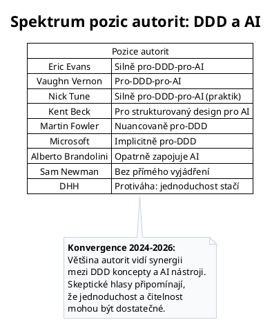

# DDD a umělá inteligence — Implementation Plan

> **For agentic workers:** REQUIRED SUB-SKILL: Use superpowers:subagent-driven-development (recommended) or superpowers:executing-plans to implement this plan task-by-task. Steps use checkbox (`- [ ]`) syntax for tracking.

**Goal:** Add a new chapter "DDD a umělá inteligence — co říkají autority" as a full page on the DDD Symfony educational website.

**Architecture:** New route in DddController, new Twig template following existing patterns (JSON-LD, breadcrumbs, ARIA, meta tags), PlantUML diagram, sidebar + CHAPTERS navigation update.

**Tech Stack:** Symfony 8, Twig, PlantUML, vanilla JS/CSS

**Spec:** `docs/superpowers/specs/2026-03-27-ddd-a-ai-design.md`

---

### Task 1: Add route and controller action

**Files:**
- Modify: `src/Controller/DddController.php:161` (before closing brace)

- [ ] **Step 1: Add the controller action**

Add this action before the closing `}` of the class, after the `whenNotToUseDdd()` method:

```php
    #[Route('/ddd-a-umela-inteligence', name: 'ddd_ai')]
    public function dddAi(): Response
    {
        return $this->render('ddd/ddd_ai.html.twig', [
            'title' => 'DDD a umělá inteligence — co říkají autority',
        ]);
    }
```

- [ ] **Step 2: Verify route is registered**

Run: `php bin/console debug:router ddd_ai`
Expected: Route `/ddd-a-umela-inteligence` pointing to `DddController::dddAi`

- [ ] **Step 3: Commit**

```bash
git add src/Controller/DddController.php
git commit -m "feat: přidat route /ddd-a-umela-inteligence"
```

---

### Task 2: Create the PlantUML spectrum diagram

**Files:**
- Create: `templates/diagrams/10_ddd_ai/spectrum.puml`
- Create: `templates/diagrams/10_ddd_ai/spectrum.svg`

- [ ] **Step 1: Create the PlantUML source**

Create `templates/diagrams/10_ddd_ai/spectrum.puml`:



- [ ] **Step 2: Generate the SVG**

Run: `plantuml -tsvg templates/diagrams/10_ddd_ai/spectrum.puml -o .`

If `plantuml` is not available, create the SVG manually or skip — the template can include the diagram later. For now, create a placeholder note in the template.

- [ ] **Step 3: Commit**

```bash
git add templates/diagrams/10_ddd_ai/
git commit -m "feat: přidat PlantUML diagram spektra pozic autorit k DDD a AI"
```

---

### Task 3: Create the Twig template — scaffold + úvod (sekce 1)

**Files:**
- Create: `templates/ddd/ddd_ai.html.twig`

- [ ] **Step 1: Create the template file with full scaffolding and section 1**

Create `templates/ddd/ddd_ai.html.twig` with:
- `extends 'base.html.twig'`
- All required blocks: `title`, `meta_description`, `meta_keywords`, `structured_data`, `body`, `toc`
- JSON-LD TechArticle structured data (author: Michal Katuščák, datePublished: 2026-03-27)
- `<article itemscope itemtype="https://schema.org/TechArticle">`
- `<h1 itemprop="headline">DDD a umělá inteligence — co říkají autority</h1>`
- Table of contents (`role="navigation"`, `aria-labelledby="toc-heading"`) with all 8 section links
- Section 1 (Úvod): paragraphs introducing the topic — why DDD+AI is relevant in 2024-2026, what the article covers, what it doesn't (not a benchmark, not a tutorial)

Template structure (showing scaffold + section 1 content):

```twig


DDD a umělá inteligence — co říkají autority | DDD Symfony

Objektivní přehled názorů klíčových autorit softwarového inženýrství na vztah Domain-Driven Designu a umělé inteligence. Eric Evans, Martin Fowler, Kent Beck, DHH a další — jejich pozice, argumenty a data.

DDD AI, domain-driven design umělá inteligence, DDD LLM, Eric Evans AI, Martin Fowler AI, Kent Beck AI, DDD bounded context AI, ubiquitous language LLM


<script type="application/ld+json">
{
  "@context": "https://schema.org",
  "@type": "TechArticle",
  "headline": "DDD a umělá inteligence — co říkají autority",
  "description": "{{ block('meta_description') }}",
  "keywords": "{{ block('meta_keywords') }}",
  "author": {
    "@type": "Person",
    "name": "Michal Katuščák"
  },
  "publisher": {
    "@type": "Person",
    "name": "Michal Katuščák"
  },
  "datePublished": "2026-03-27",
  "dateModified": "2026-03-27",
  "mainEntityOfPage": {
    "@type": "WebPage",
    "@id": "{{ app.request.schemeAndHttpHost }}{{ app.request.pathInfo }}"
  }
}
</script>



<article itemscope itemtype="https://schema.org/TechArticle">
    <h1 itemprop="headline">DDD a umělá inteligence — co říkají autority</h1>

    <p>
        Umělá inteligence mění způsob, jakým vývojáři navrhují a píší software. Nástroje jako GitHub Copilot,
        Cursor a Claude Code dnes generují kód, navrhují architekturu a pomáhají s refaktoringem. Vzniká
        přirozená otázka: jsou některé architektonické přístupy pro spolupráci s AI vhodnější než jiné?
    </p>

    <p>
        Domain-Driven Design se svými koncepty — ubiquitous language, bounded contexts, agregáty — nabízí
        strukturu, která by mohla AI nástrojům usnadnit orientaci v kódu. Současně ale existují hlasy,
        které tvrdí, že jednoduchá a čitelná architektura je pro AI stejně dobrá nebo lepší.
    </p>

    <p>
        Tento článek mapuje, co k tématu říkají klíčové autority softwarového inženýrství — od tvůrce DDD
        Erica Evanse po skeptiky jako David Heinemeier Hansson. Cílem není obhajoba ani kritika žádného
        přístupu, ale objektivní přehled současného stavu diskuse podložený citacemi, daty a kontextem.
        Článek není benchmark ani tutorial — je to průvodce tím, co víme a co zatím nevíme.
    </p>

    <div class="table-of-contents mb-4" role="navigation" aria-labelledby="toc-heading">
        <p id="toc-heading">Obsah kapitoly:</p>
        <ul>
            <li><a href="#ubiquitous-language">Ubiquitous language jako rozhraní pro LLM</a></li>
            <li><a href="#bounded-contexts">Bounded contexts a kvalita generovaného kódu</a></li>
            <li><a href="#testovani">Testování jako kontrolní mechanismus pro AI</a></li>
            <li><a href="#komplexita-vs-crud">AI v doménové komplexitě vs. CRUD</a></li>
            <li><a href="#nastroje">Architektonické nástroje a kontext pro AI</a></li>
            <li><a href="#otevrene-otazky">Otevřené otázky a limity</a></li>
            <li><a href="#zaver">Závěr</a></li>
            <li><a href="#zdroje">Zdroje a další čtení</a></li>
        </ul>
    </div>

    {# Sections 2-8 will be added in subsequent tasks #}

</article>



<p class="toc-title">Na této stránce</p>
<ul>
    <li><a href="#ubiquitous-language">Ubiquitous language a LLM</a></li>
    <li><a href="#bounded-contexts">Bounded contexts</a></li>
    <li><a href="#testovani">Testování a AI</a></li>
    <li><a href="#komplexita-vs-crud">Komplexita vs. CRUD</a></li>
    <li><a href="#nastroje">Nástroje a kontext</a></li>
    <li><a href="#otevrene-otazky">Otevřené otázky</a></li>
    <li><a href="#zaver">Závěr</a></li>
    <li><a href="#zdroje">Zdroje</a></li>
</ul>

```

- [ ] **Step 2: Verify the page renders**

Run: `symfony server:start -d` (if not running), then open `http://localhost:8000/ddd-a-umela-inteligence`
Expected: Page renders with title, intro paragraphs, and table of contents.

- [ ] **Step 3: Commit**

```bash
git add templates/ddd/ddd_ai.html.twig
git commit -m "feat: přidat scaffold šablony DDD a AI s úvodem"
```

---

### Task 4: Write section 2 — Ubiquitous language jako rozhraní pro LLM

**Files:**
- Modify: `templates/ddd/ddd_ai.html.twig` (replace `{# Sections 2-8 will be added in subsequent tasks #}` placeholder)

- [ ] **Step 1: Add section 2 content**

Replace `{# Sections 2-8 will be added in subsequent tasks #}` with the section below (keep a new placeholder `{# Sections 3-8 #}` after it):

```twig
    {# ═══════════════════════════════════════════════════════════
       Ubiquitous language jako rozhraní pro LLM
       ═══════════════════════════════════════════════════════════ #}
    <section id="ubiquitous-language" aria-labelledby="ubiquitous-language-heading">
        <h2 id="ubiquitous-language-heading">Ubiquitous language jako rozhraní pro LLM</h2>

        <p>
            Velké jazykové modely (LLM) ze své podstaty pracují s přirozeným jazykem. Ubiquitous language —
            jeden z pilířů DDD — je pokus o přesnou, sdílenou podmnožinu přirozeného jazyka pro konkrétní
            doménu. Otázka, zda tyto dva koncepty vytvářejí přirozenou synergii, se stala jedním
            z nejdiskutovanějších témat na pomezí DDD a AI.
        </p>

        <h3>Eric Evans: fine-tuned LLM jako bounded context</h3>

        <p>
            Na konferenci Explore DDD 2024 v Denveru představil Eric Evans — tvůrce DDD — jeden
            z nejkonkrétnějších návrhů na propojení DDD a LLM. Navrhl, že jazykový model natrénovaný
            na ubiquitous language konkrétního bounded contextu může být levnější a přesnější než
            generický model doplněný o složité prompty.
        </p>

        <blockquote>
            <p>
                „Několik fine-tuned modelů, každý určený pro jiný účel — to je silné oddělení zodpovědností."
            </p>
            <footer>— Eric Evans, Explore DDD 2024 Keynote</footer>
        </blockquote>

        <p>
            Evans dále předpověděl, že doménoví modeléři budou postupně identifikovat úlohy zpracování
            přirozeného jazyka jako samostatné subdomény vyžadující vlastní návrh LLM. Současně
            zdůraznil, že jeho komentáře jsou časově citlivé — landscape se mění příliš rychle
            na trvalé závěry.
        </p>

        <h3>Martin Fowler: DSL pro přesnější komunikaci s AI</h3>

        <p>
            Martin Fowler, přestože není zastáncem žádného konkrétního přístupu, naznačil, že DDD
            a doménově specifické jazyky (DSL) mohou nabídnout cestu k „rigoroznějšímu" způsobu
            komunikace s LLM. V rozhovoru pro Pragmatic Engineer popsal potřebu přijít na
            „přesnější způsob, jak s LLM mluvit" — a ubiquitous language je právě pokusem
            o takovou přesnost.
        </p>

        <h3>Protiváha: je formalizace jazyka nutná?</h3>

        <p>
            David Heinemeier Hansson (DHH), tvůrce Ruby on Rails, zastává opačnou pozici.
            Podle něj je přílišná formalizace jazyka zbytečná režie. Ruby je ze své podstaty
            dostatečně čitelné pro AI — a „AI's preferred format" je Markdown, nikoliv
            formalizovaný doménový jazyk. DHH při prezentaci Rails 8.1 přidal nativní
            Markdown rendering právě s argumentem, že jde o formát, kterému AI rozumí nejlépe.
        </p>

        <p>
            Tento protiargument má váhu zejména u projektů, kde je doménová terminologie jednoduchá
            a kód je dostatečně expresivní sám o sobě. Otázka, zda ubiquitous language přidává AI
            skutečnou hodnotu, nebo jen další vrstvu abstrakce, zůstává otevřená.
        </p>
    </section>

    {# Sections 3-8 #}
```

Content guidelines for this section (~600-800 words Czech):
- Evans keynote at Explore DDD 2024: fine-tuned LLMs as bounded contexts, ubiquitous language for training, "several fine-tuned models = strong separation of concerns"
- Fowler: DDD/DSL for more rigorous prompting
- Counterpoint DHH: Ruby is readable enough, Markdown is AI's preferred format
- Context: LLMs work with natural language; ubiquitous language is a precise subset of natural language

- [ ] **Step 2: Verify the page renders correctly**

Open `http://localhost:8000/ddd-a-umela-inteligence` and confirm section 2 appears with proper formatting.

- [ ] **Step 3: Commit**

```bash
git add templates/ddd/ddd_ai.html.twig
git commit -m "feat: přidat sekci Ubiquitous language jako rozhraní pro LLM"
```

---

### Task 5: Write section 3 — Bounded contexts a kvalita generovaného kódu

**Files:**
- Modify: `templates/ddd/ddd_ai.html.twig` (replace `{# Sections 3-8 #}`)

- [ ] **Step 1: Add section 3 content**

Replace `{# Sections 3-8 #}` with (keep `{# Sections 4-8 #}` placeholder after):

```twig
    {# ═══════════════════════════════════════════════════════════
       Bounded contexts a kvalita generovaného kódu
       ═══════════════════════════════════════════════════════════ #}
    <section id="bounded-contexts" aria-labelledby="bounded-contexts-heading">
        <h2 id="bounded-contexts-heading">Bounded contexts a kvalita generovaného kódu</h2>

        <p>
            Bounded context — jasně vymezená hranice, ve které má model jednoznačný význam —
            je jedním z nejpraktičtějších konceptů DDD pro práci s AI nástroji. Výzkumná data
            naznačují, že omezení kontextu, který AI vidí, výrazně zlepšuje kvalitu generovaného kódu.
        </p>

        <h3>Data: vliv bounded contexts na generování kódu</h3>

        <p>
            Analýza zveřejněná na UnderstandingData.com porovnala kvalitu kódu generovaného LLM
            s přístupem k celému repozitáři oproti kódu generovanému v rámci jasně definovaných
            bounded contexts:
        </p>

        <div class="table-responsive">
            <table class="table">
                <thead>
                    <tr>
                        <th>Metrika</th>
                        <th>Bez DDD</th>
                        <th>S bounded contexts</th>
                    </tr>
                </thead>
                <tbody>
                    <tr>
                        <td>Production-ready kód</td>
                        <td>~55 %</td>
                        <td>~88 %</td>
                    </tr>
                    <tr>
                        <td>Porušení hranic</td>
                        <td>35 %</td>
                        <td>&lt;5 %</td>
                    </tr>
                    <tr>
                        <td>Potřebný kontext z codebase</td>
                        <td>100 %</td>
                        <td>15–25 %</td>
                    </tr>
                </tbody>
            </table>
        </div>

        <p>
            Tato data je třeba interpretovat obezřetně — jde o jednu studii s konkrétní metodologií,
            nikoliv o systematický přehled. Nicméně trend je konzistentní s teoretickými předpoklady:
            méně kontextu znamená méně šumu a přesnější výstupy.
        </p>

        <h3>Nick Tune: living documentation pro AI agenty</h3>

        <p>
            Nick Tune, autor knihy <em>Architecture Modernization</em> (Manning, 2024) a jeden
            z nejaktivnějších praktiků na průsečíku DDD a AI, vyvinul proof-of-concept,
            který pomocí ts-morph extrahuje architektonické informace z kódu — vstupní body,
            doménové operace, eventy, handlery — a vytváří z nich living documentation.
        </p>

        <p>
            Klíčová myšlenka: tato dokumentace neslouží jen lidem, ale i AI agentům.
            Doménové modely exportované jako strukturovaný kontext pro Claude Code, Cursor
            nebo jiné LLM nástroje umožňují AI pracovat v rámci konkrétního bounded contextu,
            místo aby se pokoušel porozumět celému systému najednou.
        </p>

        <h3>Protiváha: churn rate a architektonická nekonzistence</h3>

        <p>
            Analýza GitClear z roku 2024 ukázala, že AI-generovaný kód má o 41 % vyšší
            churn rate (míru přepisů) než kód psaný lidmi. Bounded contexts tento problém
            zmírňují — omezují blast radius chybného kódu — ale neodstraňují ho.
            AI má tendenci generovat kód, který je „lokálně koherentní, ale architektonicky
            nekonzistentní" — funguje v rámci jednoho souboru, ale porušuje širší
            architektonická pravidla.
        </p>
    </section>

    {# Sections 4-8 #}
```

- [ ] **Step 2: Verify rendering**

Open the page in browser, confirm table renders correctly and section appears.

- [ ] **Step 3: Commit**

```bash
git add templates/ddd/ddd_ai.html.twig
git commit -m "feat: přidat sekci Bounded contexts a kvalita generovaného kódu"
```

---

### Task 6: Write section 4 — Testování jako kontrolní mechanismus pro AI

**Files:**
- Modify: `templates/ddd/ddd_ai.html.twig` (replace `{# Sections 4-8 #}`)

- [ ] **Step 1: Add section 4 content**

Replace `{# Sections 4-8 #}` with (keep `{# Sections 5-8 #}` placeholder after):

```twig
    {# ═══════════════════════════════════════════════════════════
       Testování jako kontrolní mechanismus pro AI
       ═══════════════════════════════════════════════════════════ #}
    <section id="testovani" aria-labelledby="testovani-heading">
        <h2 id="testovani-heading">Testování jako kontrolní mechanismus pro AI</h2>

        <p>
            Pokud AI generuje kód, kdo kontroluje jeho správnost? Testy — zejména automatizované
            unit testy — se ukazují jako nejspolehlivější mechanismus. A právě zde se DDD komunita,
            historicky silně propojená s praktikami jako TDD, nachází v unikátní pozici.
        </p>

        <h3>Kent Beck: TDD jako „superpower" pro AI</h3>

        <p>
            Kent Beck, tvůrce extrémního programování a test-driven developmentu, po 52 letech
            programování popisuje TDD jako „superpower" pro práci s AI agenty. Podle něj je
            nejjednodušší způsob, jak zajistit, že AI agenti nezavedou regrese, mít pro celý
            codebase unit testy.
        </p>

        <p>
            Beck rozlišuje dva přístupy k práci s AI:
        </p>

        <ul>
            <li>
                <strong>Augmented coding</strong> — udržuje tradiční standardy softwarového inženýrství
                (čitelný kód, zvládnutelná složitost, dobrá testová pokrytost, solidní architektura)
                a zároveň využívá AI. Integruje TDD, princip „Tidy First" a povinné code review.
            </li>
            <li>
                <strong>Vibe coding</strong> — zachází s AI jako s „generátorem magických řešení",
                kde záleží jen na chování, nikoliv na kvalitě kódu.
            </li>
        </ul>

        <blockquote>
            <p>
                „Dnešní AI asistenti nemají taste — přidávají zbytečný kód, aniž by chápali,
                že nemají jíst osivo."
            </p>
            <footer>— Kent Beck, Augmented Coding: Beyond the Vibes</footer>
        </blockquote>

        <h3>Martin Fowler: AI jako „dodgy collaborator"</h3>

        <p>
            Fowler používá metaforu „dodgy collaborator" — AI je produktivní v řádcích kódu,
            ale nelze mu věřit. Každý výstup AI by měl být zacházený jako pull request od
            kolegy, kterému důvěřujete na úrovni produktivity, ale nikoliv na úrovni
            architektonického rozhodování.
        </p>

        <blockquote>
            <p>
                „Musíte zacházet s každým kusem jako s pull requestem od poněkud pochybného
                kolegy, který je velmi produktivní ve smyslu řádků kódu, ale víte, že nemůžete
                věřit ničemu, co dělá."
            </p>
            <footer>— Martin Fowler, Pragmatic Engineer interview</footer>
        </blockquote>

        <h3>Protiváha: drénuje AI kompetence vývojářů?</h3>

        <p>
            DHH při rozhovoru s Lexem Fridmanem popsal znepokojivý efekt: „Doslova cítím, jak mi
            kompetence vytéká z prstů!" při používání AI-generovaného kódu bez vlastního psaní.
            Varuje, že vývojář, který se „povýší" z programování na řízení AI, se stane
            „project managerem hejna AI vran" — a ztratí schopnost kód skutečně posoudit.
        </p>

        <p>
            Tento argument neoponuje testování jako takovému, ale upozorňuje na hlubší problém:
            pokud vývojáři přestanou kódu rozumět, budou jejich testy skutečně kvalitní?
            TDD předpokládá, že vývojář ví, co testovat — a právě tato znalost může
            při nadměrném spoléhání na AI erodovat.
        </p>
    </section>

    {# Sections 5-8 #}
```

- [ ] **Step 2: Verify rendering**

Open the page, confirm section 4 appears correctly.

- [ ] **Step 3: Commit**

```bash
git add templates/ddd/ddd_ai.html.twig
git commit -m "feat: přidat sekci Testování jako kontrolní mechanismus pro AI"
```

---

### Task 7: Write section 5 — AI v doménové komplexitě vs. CRUD

**Files:**
- Modify: `templates/ddd/ddd_ai.html.twig` (replace `{# Sections 5-8 #}`)

- [ ] **Step 1: Add section 5 content**

Replace `{# Sections 5-8 #}` with (keep `{# Sections 6-8 #}` placeholder after):

```twig
    {# ═══════════════════════════════════════════════════════════
       AI v doménové komplexitě vs. CRUD
       ═══════════════════════════════════════════════════════════ #}
    <section id="komplexita-vs-crud" aria-labelledby="komplexita-vs-crud-heading">
        <h2 id="komplexita-vs-crud-heading">AI v doménové komplexitě vs. CRUD</h2>

        <p>
            Kde přesně leží hranice, za kterou se DDD vyplatí? A mění AI tuto hranici?
            Odpovědi se liší podle toho, koho se zeptáte — od Evansovy nové kategorie
            „LLM-supported" domén po DHH-ho přiznání, že většina práce je CRUD.
        </p>

        <h3>Eric Evans: třetí kategorie zpracování domény</h3>

        <p>
            Evans na Explore DDD 2024 navrhl rozšíření tradičního modelu o třetí kategorii:
        </p>

        <ol>
            <li><strong>Hard-coded</strong> — strukturovaný doménový model v kódu</li>
            <li><strong>Human-handled</strong> — části, které řeší lidé (rozhodování, výjimky)</li>
            <li><strong>LLM-supported</strong> — části systému, které „nikdy nezapadnou do
                strukturovaných modelů", ale jsou příliš složité na jednoduché if/else</li>
        </ol>

        <p>
            Tato třetí kategorie je klíčová — Evans tvrdí, že některé aspekty domény se vždy
            vzpíraly formalizaci a dosud je řešili lidé. LLM mohou tuto mezeru vyplnit.
        </p>

        <h3>Vaughn Vernon: self-healing software</h3>

        <p>
            Vaughn Vernon, autor <em>Implementing Domain-Driven Design</em>, vidí konkrétní
            aplikaci v self-healing softwaru: LLM jako „fix suggester", který reaguje na
            runtime výjimky a automaticky vytvoří pull request s navrženou opravou.
            Jde o aplikaci AI nikoliv na generování nového kódu, ale na údržbu existujícího
            doménového modelu.
        </p>

        <h3>Microsoft: pragmatický matching</h3>

        <p>
            Microsoft ve svém referenčním projektu eShopOnContainers demonstruje pragmatický
            přístup: ordering microservice používá plné DDD (agregáty, doménové eventy, CQRS),
            zatímco catalog microservice je jednoduchý CRUD. Architektura odpovídá doménové
            složitosti — ne naopak. Tento vzor je implicitně relevantní i pro AI:
            generovat DDD kód tam, kde je potřeba, a CRUD tam, kde stačí.
        </p>

        <h3>Protiváha: většina práce je CRUD</h3>

        <p>
            DHH na Rails World 2025 prohlásil: „Moje kariéra je CRUD monkeying. Čtu věci
            z databáze, vytvářím záznamy, aktualizuju je a občas mažu." Podle něj většina
            softwarových projektů spadá do kategorie, kde DDD přidává zbytečnou režii:
        </p>

        <blockquote>
            <p>
                „Přestali jsme řešit celé problémy. Místo toho krajíme všechno na malé kousíčky,
                optimalizujeme každý zvlášť, a když to dáme zpátky dohromady, jsme vlastně horší
                než na začátku."
            </p>
            <footer>— DHH, Rails World 2025 Keynote</footer>
        </blockquote>

        <p>
            Otázka tak není „DDD nebo CRUD", ale spíše: kde leží hranice složitosti,
            za kterou se DDD vyplatí — a mění AI tuto hranici? Pokud AI dokáže generovat
            kvalitní DDD kód levně, snižuje se bariéra pro jeho zavedení. Pokud ale AI
            dokáže generovat kvalitní CRUD kód ještě levněji, může se argument pro DDD
            naopak oslabit.
        </p>
    </section>

    {# Sections 6-8 #}
```

- [ ] **Step 2: Verify rendering**

Open the page, confirm section 5 appears correctly.

- [ ] **Step 3: Commit**

```bash
git add templates/ddd/ddd_ai.html.twig
git commit -m "feat: přidat sekci AI v doménové komplexitě vs. CRUD"
```

---

### Task 8: Write section 6 — Architektonické nástroje a kontext pro AI

**Files:**
- Modify: `templates/ddd/ddd_ai.html.twig` (replace `{# Sections 6-8 #}`)

- [ ] **Step 1: Add section 6 content**

Replace `{# Sections 6-8 #}` with (keep `{# Sections 7-8 #}` placeholder after):

```twig
    {# ═══════════════════════════════════════════════════════════
       Architektonické nástroje a kontext pro AI
       ═══════════════════════════════════════════════════════════ #}
    <section id="nastroje" aria-labelledby="nastroje-heading">
        <h2 id="nastroje-heading">Architektonické nástroje a kontext pro AI</h2>

        <p>
            Bez ohledu na to, zda projekt používá DDD, moderní AI nástroje implementují
            mechanismy pro poskytování architektonického kontextu — a tyto mechanismy
            nápadně připomínají koncepty z DDD.
        </p>

        <h3>Konfigurační soubory jako bounded context</h3>

        <p>
            Hlavní AI coding nástroje dnes nabízejí způsob, jak AI poskytnout
            projektově specifický kontext:
        </p>

        <ul>
            <li>
                <strong>Cursor</strong> — adresář <code>.cursor/rules/</code>
                s <code>.mdc</code> soubory definujícími architektonická pravidla.
                Komunita na Cursor.directory sdílí pravidla včetně DDD a Clean Architecture
                šablon. Cursor navíc sémanticky indexuje celý repozitář.
            </li>
            <li>
                <strong>GitHub Copilot</strong> — Copilot Instructions umožňují definovat
                konvence, architektonické vzory a testovací pravidla. Na GitHubu existuje
                repozitář s DDD a Clean Architecture šablonami.
            </li>
            <li>
                <strong>Claude Code</strong> — soubor <code>CLAUDE.md</code> v kořeni
                projektu slouží jako projektový kontext — analogie k dokumentaci
                bounded contextu.
            </li>
        </ul>

        <p>
            Všechny tyto mechanismy de facto implementují stejný princip: dej AI omezený,
            doménově specifický kontext místo přístupu k celému kódu bez vodítek. To je
            přesně to, co bounded context v DDD dělá — vymezuje hranici, ve které mají
            pojmy jednoznačný význam.
        </p>

        <h3>Akademický výzkum</h3>

        <p>
            Téma přitahuje i akademickou pozornost. Na konferenci KDD 2024 prezentoval tým
            z AWS přístup „Domain-Driven LLM Development", který zkoumá, jak doménové znalosti
            zlepšují výstupy LLM. Na arXiv (2025) se objevila práce „Leveraging Generative AI
            for Enhancing Domain-Driven Software Design", která zkoumá opačný směr — jak může
            AI pomoci při samotném doménovém modelování.
        </p>

        <h3>Protiváha: nástroje fungují i bez DDD</h3>

        <p>
            Je důležité poznamenat, že tyto konfigurační soubory fungují i u projektů, které
            DDD nepoužívají. Jednoduchý, dobře napsaný kód s jasnými konvencemi může být
            pro AI stejně srozumitelný jako formalizovaný DDD model. Struktura není totéž co DDD —
            a DDD není jediný způsob, jak kódu dát strukturu.
        </p>

        <p>
            Článek „DHH Is Wrong: Rails Isn't a Great Fit for AI-Era Development" argumentuje,
            že konvence Rails nemusí poskytovat dostatečnou strukturu pro AI nástroje. Opačný
            pohled tvrdí, že právě konvence (convention over configuration) dávají AI dostatek
            vodítek bez nutnosti explicitní konfigurace. Diskuse zůstává otevřená.
        </p>
    </section>

    {# Sections 7-8 #}
```

- [ ] **Step 2: Verify rendering**

Open the page, confirm section 6 appears correctly.

- [ ] **Step 3: Commit**

```bash
git add templates/ddd/ddd_ai.html.twig
git commit -m "feat: přidat sekci Architektonické nástroje a kontext pro AI"
```

---

### Task 9: Write sections 7-8 — Otevřené otázky, Závěr a Zdroje

**Files:**
- Modify: `templates/ddd/ddd_ai.html.twig` (replace `{# Sections 7-8 #}`)

- [ ] **Step 1: Add sections 7 and 8 content**

Replace `{# Sections 7-8 #}` with:

```twig
    {# ═══════════════════════════════════════════════════════════
       Otevřené otázky a limity
       ═══════════════════════════════════════════════════════════ #}
    <section id="otevrene-otazky" aria-labelledby="otevrene-otazky-heading">
        <h2 id="otevrene-otazky-heading">Otevřené otázky a limity</h2>

        <p>
            Vztah DDD a AI je téma, které se vyvíjí rychleji, než o něm vznikají systematické
            studie. I autority, které se k němu vyjadřují, často zdůrazňují, co zatím nevíme.
        </p>

        <h3>Nedeterminismus a metriky</h3>

        <p>
            Martin Fowler označil AI za „největší posun v programování, jaký ve své kariéře
            viděl" — a současně přiznal: „Stále se učíme, jak to dělat." Jedním z jeho
            klíčových požadavků je, aby LLM přicházely s metrikami popisujícími jejich přesnost:
            „Jaké jsou tolerance nedeterminismu, se kterými se musíme vypořádat?"
        </p>

        <p>
            Tato otázka je relevantní pro DDD i mimo něj. Pokud AI generuje doménový kód
            s 88% úspěšností (jak naznačují data o bounded contexts), co se stane
            s těmi 12 %? V doméně finančních transakcí nebo zdravotnictví může být
            i malá chybovost nepřijatelná.
        </p>

        <h3>Alberto Brandolini: opatrné zapojování</h3>

        <p>
            Alberto Brandolini, tvůrce EventStormingu, přistupuje k AI pragmaticky
            bez velkolepých proklamací. Jeho společnost Avanscoperta nyní nabízí kurzy
            kombinující DDD s AI coding asistenty, ale nezastává silnou ideologickou
            pozici. EventStorming nástroje začínají AI podporu integrovat — pro návrhy
            procesních kroků — ale jde o evoluci, nikoliv revoluci.
        </p>

        <h3>Sam Newman: složitost jako poslední možnost</h3>

        <p>
            Sam Newman, autor knih o mikroslužbách a silný zastánce DDD konceptů
            (bounded contexts, agregáty, ubiquitous language), veřejně k propojení
            DDD a AI zatím jasně nevystoupil. Jeho obecná filozofie — distribuované
            systémy jako „poslední možnost", jednoduchost jako výchozí stav — naznačuje,
            že by pravděpodobně doporučil obezřetnost: přidávat DDD strukturu jen tam,
            kde prokazatelně pomáhá, a nepřidávat ji jen proto, že „AI to zvládne lépe."
        </p>

        <h3>Otevřené otázky pro další výzkum</h3>

        <ul>
            <li>Mění AI hranici doménové složitosti, od které se DDD vyplatí?</li>
            <li>Stane se ubiquitous language standardním vstupem pro AI nástroje?</li>
            <li>Jak se změní role softwarového architekta v éře AI?</li>
            <li>Jsou data o bounded contexts (55 % → 88 %) replikovatelná v různých doménách?</li>
            <li>Jaký je dlouhodobý dopad AI na kvalitu doménových modelů?</li>
        </ul>
    </section>

    {# ═══════════════════════════════════════════════════════════
       Závěr
       ═══════════════════════════════════════════════════════════ #}
    <section id="zaver" aria-labelledby="zaver-heading">
        <h2 id="zaver-heading">Závěr</h2>

        <p>
            Většina autorit softwarového inženýrství — Eric Evans, Vaughn Vernon, Nick Tune,
            Kent Beck i Martin Fowler — vidí synergii mezi DDD koncepty a AI nástroji.
            Ubiquitous language se nabízí jako přirozené rozhraní pro LLM, bounded contexts
            omezují kontext a zlepšují kvalitu generovaného kódu, a TDD slouží jako kontrolní
            mechanismus pro nedeterministické výstupy AI.
        </p>

        <p>
            Skeptické hlasy — zejména DHH — připomínají, že většina softwarových projektů
            je jednoduchá a jednoduchost a čitelnost kódu mohou být pro AI stejně hodnotné
            jako formalizovaná architektura. Přehnané architektonické investice mohou být
            kontraproduktivní bez ohledu na to, zda kód píše člověk nebo AI.
        </p>

        <p>
            Stav diskuse v roce 2026 směřuje ke konvergenci: struktura pomáhá AI,
            ale není jedinou cestou. Klíčové je rozhodovat se na základě konkrétní domény,
            týmu a projektu — nikoliv na základě toho, co je populární. AI mění nástroje,
            kterými software vzniká, ale základní otázky softwarového inženýrství — kde
            investovat do struktury a kde ji ušetřit — zůstávají stejné.
        </p>
    </section>

    {# ═══════════════════════════════════════════════════════════
       Zdroje
       ═══════════════════════════════════════════════════════════ #}
    <section id="zdroje" aria-labelledby="zdroje-heading">
        <h2 id="zdroje-heading">Zdroje a další čtení</h2>

        <ul>
            <li>Evans, E. — <a href="https://www.infoq.com/news/2024/03/Evans-ddd-experiment-llm/" rel="noopener noreferrer" target="_blank">Eric Evans Encourages DDD Practitioners to Experiment with LLMs</a> (InfoQ, 2024)</li>
            <li>Fowler, M. — <a href="https://thenewstack.io/martin-fowler-on-preparing-for-ais-nondeterministic-computing/" rel="noopener noreferrer" target="_blank">Preparing for AI's Nondeterministic Computing</a> (The New Stack)</li>
            <li>Beck, K. — <a href="https://tidyfirst.substack.com/p/augmented-coding-beyond-the-vibes" rel="noopener noreferrer" target="_blank">Augmented Coding: Beyond the Vibes</a> (Substack)</li>
            <li>Beck, K. — <a href="https://newsletter.pragmaticengineer.com/p/tdd-ai-agents-and-coding-with-kent" rel="noopener noreferrer" target="_blank">TDD, AI agents and coding with Kent Beck</a> (Pragmatic Engineer)</li>
            <li>Heinemeier Hansson, D. — <a href="https://thenewstack.io/dhh-on-ai-vibe-coding-and-the-future-of-programming/" rel="noopener noreferrer" target="_blank">DHH on AI, Vibe Coding and the Future of Programming</a> (The New Stack)</li>
            <li>Tune, N. — <a href="https://www.oreilly.com/radar/reverse-engineering-your-software-architecture-with-claude-code-to-help-claude-code/" rel="noopener noreferrer" target="_blank">Reverse Engineering Your Software Architecture with Claude Code</a> (O'Reilly Radar)</li>
            <li>Tune, N. — <a href="https://medium.com/nick-tune-tech-strategy-blog/enterprise-wide-software-architecture-as-ddd-living-documentation-33f3d8b4ddfc" rel="noopener noreferrer" target="_blank">Enterprise-wide Software Architecture as DDD Living Documentation</a> (Medium)</li>
            <li>ThoughtWorks — <a href="https://www.thoughtworks.com/about-us/news/2025/thoughtworks-tech-radar-33-rapid-ai" rel="noopener noreferrer" target="_blank">Technology Radar Vol. 33</a> (2025)</li>
            <li><a href="https://understandingdata.com/posts/ddd-bounded-contexts-for-llms/" rel="noopener noreferrer" target="_blank">DDD Bounded Contexts: Clear Domain Boundaries for LLM Code Generation</a> (UnderstandingData)</li>
            <li><a href="https://arxiv.org/html/2601.20909" rel="noopener noreferrer" target="_blank">Leveraging Generative AI for Enhancing Domain-Driven Software Design</a> (arXiv, 2025)</li>
            <li><a href="https://visualstudiomagazine.com/articles/2024/01/25/copilot-research.aspx" rel="noopener noreferrer" target="_blank">New GitHub Copilot Research Finds 'Downward Pressure on Code Quality'</a> (Visual Studio Magazine, 2024)</li>
        </ul>
    </section>
```

- [ ] **Step 2: Verify rendering**

Open the page, confirm all sections appear, links work, page is complete.

- [ ] **Step 3: Commit**

```bash
git add templates/ddd/ddd_ai.html.twig
git commit -m "feat: přidat sekce Otevřené otázky, Závěr a Zdroje"
```

---

### Task 10: Add to sidebar navigation and CHAPTERS array

**Files:**
- Modify: `templates/base.html.twig:116-117` (after "Výkonnostní aspekty" sidebar link)
- Modify: `public/js/modern-script.js:120-121` (after "Výkonnostní aspekty" CHAPTERS entry)

- [ ] **Step 1: Add sidebar navigation link**

In `templates/base.html.twig`, after the "Výkonnostní aspekty" `<li>` (line ~117) and before the "Zdroje" `<li>`, add:

```twig
                    <li class="sidebar-nav-item">
                        <a class="sidebar-nav-link active" href="{{ path('ddd_ai') }}">DDD a AI</a>
                    </li>
```

- [ ] **Step 2: Add to CHAPTERS array**

In `public/js/modern-script.js`, after the `{ label: 'Výkonnostní aspekty', url: '/vykonnostni-aspekty' },` entry (line ~120) and before `{ label: 'Zdroje', url: '/zdroje' },`, add:

```javascript
        { label: 'DDD a AI', url: '/ddd-a-umela-inteligence' },
```

- [ ] **Step 3: Verify navigation**

Open the site, confirm:
1. "DDD a AI" appears in sidebar between "Výkonnostní aspekty" and "Zdroje"
2. Prev/next navigation works on the DDD a AI page
3. Prev/next links on adjacent pages (Výkonnostní aspekty → DDD a AI → Zdroje) are correct

- [ ] **Step 4: Commit**

```bash
git add templates/base.html.twig public/js/modern-script.js
git commit -m "feat: přidat DDD a AI do sidebar navigace a CHAPTERS pole"
```

---

### Task 11: Add to homepage feature grid (optional)

**Files:**
- Modify: `templates/ddd/index.html.twig` (feature grid section)

- [ ] **Step 1: Check index.html.twig for feature grid structure**

Read the index template to find where feature cards are listed and their HTML pattern.

- [ ] **Step 2: Add DDD a AI feature card**

Add a card following the existing pattern, with appropriate title, description and link to `/ddd-a-umela-inteligence`.

- [ ] **Step 3: Verify homepage**

Open `http://localhost:8000/`, confirm the new card appears in the grid.

- [ ] **Step 4: Commit**

```bash
git add templates/ddd/index.html.twig
git commit -m "feat: přidat DDD a AI kartu na homepage"
```
